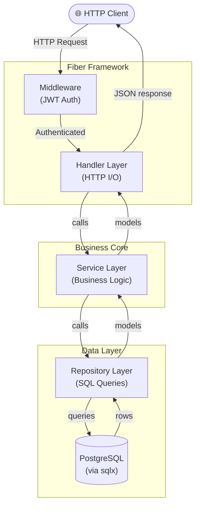
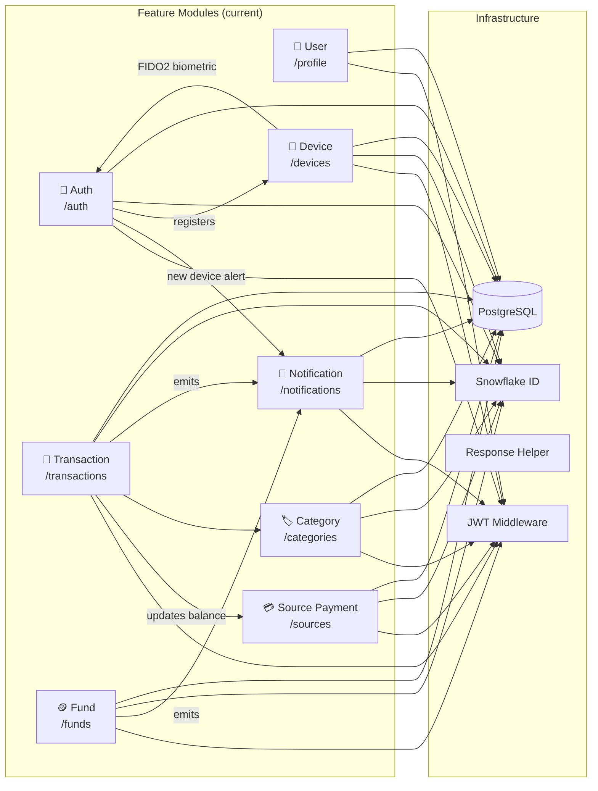
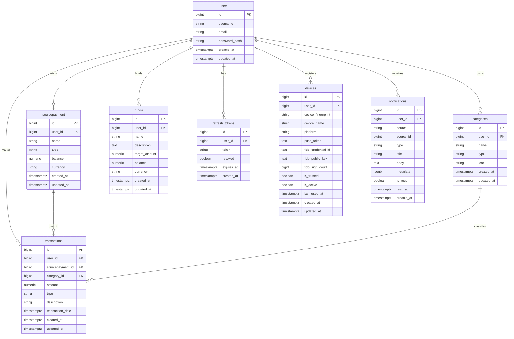
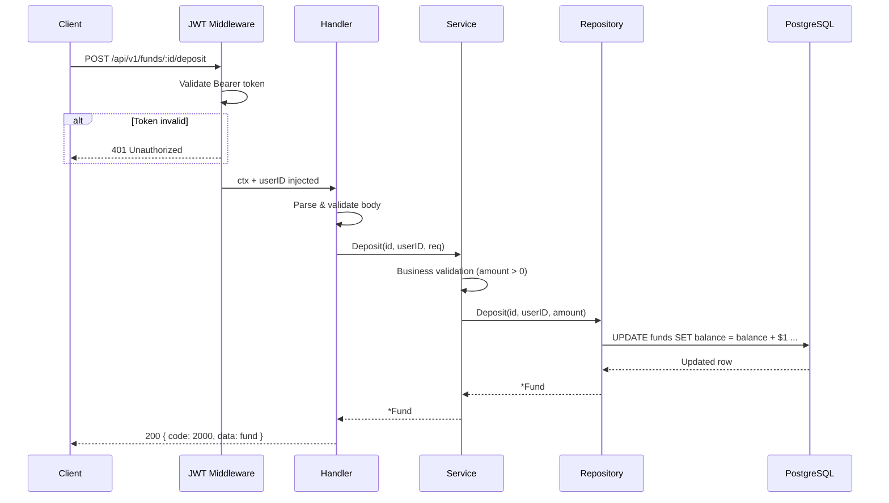
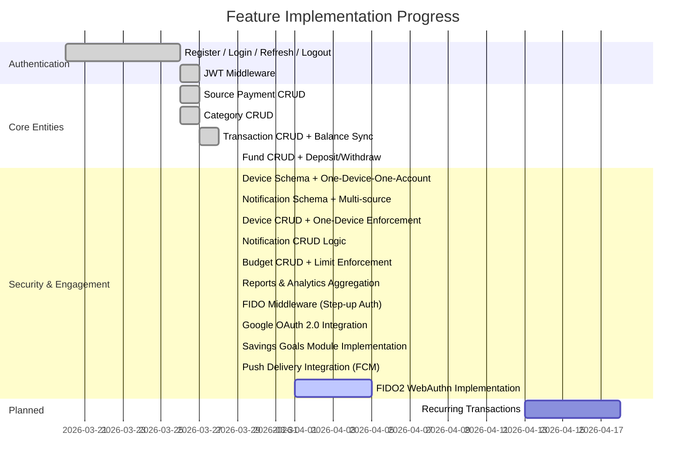

# System Architecture

A comprehensive overview of the project's layered architecture, entity relationships,
and current implementation status.

---

## 1. Clean Architecture Layers

The project strictly follows **Clean Architecture** with 4 dependency layers.
Each layer only depends on the layer below it — never the reverse.

---

## 2. Project Module Map

---

## 3. Entity Relationship Diagram

---

## 4. Request Lifecycle

---

## 5. API Endpoint Reference

> **Convention:** All endpoints use `POST`. Action intent is expressed in the URL path, not the HTTP method.

### Public Endpoints (no auth required)

| Method | Path | Description |
|---|---|---|
| `POST` | `/api/v1/auth/register` | Register a new user |
| `POST` | `/api/v1/auth/login` | Log in, receive JWT pair |
| `POST` | `/api/v1/auth/refresh` | Refresh access token |
| `POST` | `/api/v1/auth/logout` | Revoke refresh token |
| `POST` | `/api/v1/auth/google/url` | Get Google login URL |
| `POST` | `/api/v1/auth/google/callback` | OAuth2 callback handler |

### Protected Endpoints (Bearer JWT required)

#### 👤 User
| Method | Path | Description |
|---|---|---|
| `POST` | `/api/v1/profile/me` | Get current user profile |

#### 💳 Source Payment
| Method | Path | Description |
|---|---|---|
| `POST` | `/api/v1/sources/create` | Create a payment source |
| `POST` | `/api/v1/sources/list` | List all sources |
| `POST` | `/api/v1/sources/detail/:id` | Get a source by ID |
| `POST` | `/api/v1/sources/update/:id` | Update a source |
| `POST` | `/api/v1/sources/delete/:id` | Delete a source |

#### 🏷️ Category
| Method | Path | Description |
|---|---|---|
| `POST` | `/api/v1/categories/create` | Create a category |
| `POST` | `/api/v1/categories/list` | List all categories |
| `POST` | `/api/v1/categories/detail/:id` | Get a category by ID |
| `POST` | `/api/v1/categories/update/:id` | Update a category |
| `POST` | `/api/v1/categories/delete/:id` | Delete a category |

#### 💸 Transaction
| Method | Path | Body Params | Description |
|---|---|---|---|
| `POST` | `/api/v1/transactions/create` | — | Create a transaction |
| `POST` | `/api/v1/transactions/list` | `type`, `category_id`, `source_id` | List with filters |
| `POST` | `/api/v1/transactions/detail/:id` | — | Get a transaction |
| `POST` | `/api/v1/transactions/update/:id` | — | Update a transaction |
| `POST` | `/api/v1/transactions/delete/:id` | — | Delete a transaction |

#### 🪙 Fund
| Method | Path | Description |
|---|---|---|
| `POST` | `/api/v1/funds/create` | Create a fund |
| `POST` | `/api/v1/funds/list` | List all funds |
| `POST` | `/api/v1/funds/detail/:id` | Get a fund by ID |
| `POST` | `/api/v1/funds/update/:id` | Update fund metadata |
| `POST` | `/api/v1/funds/delete/:id` | Delete a fund |
| `POST` | `/api/v1/funds/deposit/:id` | Deposit money into fund |
| `POST` | `/api/v1/funds/withdraw/:id` | Withdraw money from fund |

#### 📊 Budget
| Method | Path | Description |
|---|---|---|
| `POST` | `/api/v1/budgets/create` | Create a new budget limit |
| `POST` | `/api/v1/budgets/list` | List budgets with progress |
| `POST` | `/api/v1/budgets/detail/:id` | Get budget details & spending |
| `POST` | `/api/v1/budgets/update/:id` | Update budget amount/status |
| `POST` | `/api/v1/budgets/delete/:id` | Delete a budget |

#### 📈 Reports & Analytics
| Method | Path | Body Params | Description |
|---|---|---|---|
| `POST` | `/api/v1/reports/category-summary` | `start_date`, `end_date` | Spending breakdown by category |
| `POST` | `/api/v1/reports/monthly-trend` | `months` | Income vs Expense trend |

#### 📱 Device
| Method | Path | Description |
|---|---|---|
| `POST` | `/api/v1/devices/register` | Register a new device (first login) |
| `POST` | `/api/v1/devices/list` | List user's registered devices |
| `POST` | `/api/v1/devices/delete/:id` | Remove / untrust a device |
| `POST` | `/api/v1/devices/biometric/enroll/:id` | Enroll FIDO2 biometric credential (skeleton) |
| `POST` | `/api/v1/auth/biometric` | Authenticate with FIDO2 (public - skeleton) |

#### 🔔 Notification
| Method | Path | Body Params | Description |
|---|---|---|---|
| `POST` | `/api/v1/notifications/list` | `source`, `is_read` | List notifications with filters |
| `POST` | `/api/v1/notifications/unread-count` | — | Get count of unread notifications |
| `POST` | `/api/v1/notifications/mark-read` | `ids[]` | Bulk mark notifications as read |
| `POST` | `/api/v1/notifications/delete/:id` | — | Delete a notification |

---

## 6. Implementation Status

### Current Coverage

| Module | Model | Migration | Repository | Service | Handler | Routes | Status |
|---|:---:|:---:|:---:|:---:|:---:|:---:|---|
| Auth | ✅ | ✅ | ✅ | ✅ | ✅ | ✅ | **Done** |
| User | ✅ | ✅ | ✅ | ✅ | ✅ | ✅ | **Done** |
| Source Payment | ✅ | ✅ | ✅ | ✅ | ✅ | ✅ | **Done** |
| Category | ✅ | ✅ | ✅ | ✅ | ✅ | ✅ | **Done** |
| Transaction | ✅ | ✅ | ✅ | ✅ | ✅ | ✅ | **Done** |
| Fund | ✅ | ✅ | ✅ | ✅ | ✅ | ✅ | **Done** |
| **Device** | ✅ | ✅ | ✅ | ✅ | ✅ | ✅ | **Done** |
| **Notification** | ✅ | ✅ | ✅ | ✅ | ✅ | ✅ | **Done** |
| **Budget** | ✅ | ✅ | ✅ | ✅ | ✅ | ✅ | **Done** |
| **Reports** | ✅ | ✅ | ✅ | ✅ | ✅ | ✅ | **Done** |
| **Savings Goal** | ✅ | ✅ | ✅ | ✅ | ✅ | ✅ | **Done** |
<line_break_filler>
